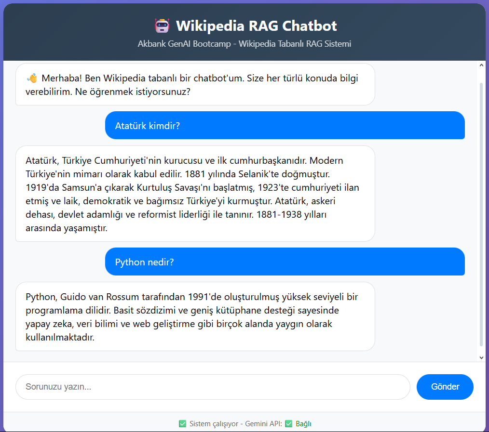

# Wikipedia Tabanlı Türkçe RAG Chatbot

## 🖼️ Arayüz Görüntüsü


*Not: Görsel "Atatürk kimdir?" ve "Python nedir?" sorularına verilen cevapları gösteriyor.*

---
## 📂 Proje Klasör Yapısı

rag-chatbot
│
├── app.py # Flask uygulama ana dosyası
├── requirements.txt # Python bağımlılıkları
├── README.md # Proje açıklamaları ve kullanım rehberi
├── .gitignore 
├── .gitattributes # Git dosya ayarları
├── data/ # Örnek veri dosyaları
│ └── sample_data.txt # Örnek soru-cevap veya doküman
├── static/ # Uygulama görseli
│ └── interface.png # Arayüz görseli
├── templates/ # HTML şablonları
│ └── index.html # Ana sayfa şablonu

---

## 1. Projenin Amacı
Bu proje, Türkçe Wikipedia makalelerini temel alarak geliştirilmiş bir **RAG (Retrieval-Augmented Generation) Chatbot** uygulamasıdır. Amaç, kullanıcıların sorularına hızlı ve doğru cevaplar verebilen bir sistem geliştirmektir. Proje özellikle:

- Türkçe doğal dil işleme
- Soru-cevap sistemleri
- AI destekli içerik üretimi  

gibi alanlarda pratik uygulama sağlamaktadır.

---

## 2. Veri Seti Hakkında
Proje için kullanılan ana veri seti:  

**Turkish Wikipedia Question-Answering Dataset**
- Kaynak: [Hugging Face](https://huggingface.co/datasets/hcsolakoglu/turkish-wikipedia-qa-4-million)  
- Lisans: CC BY-NC-SA 4.0  
- Dil: Türkçe  
- Format: Parquet  
- İçerik: 4 milyon soru-cevap çifti, 449.844 satır  

**Önemli Not:** Dataset büyük boyutlu olduğundan repoda dahil edilmemiştir. Projede fallback olarak  kod "app.py" içersinde ve `sample_data.txt` kullanılmıştır.

### Örnek Sorular
- "Atatürk kimdir?"
- "Python nedir?"
- "Niğbolu Muharebesi ne zaman oldu?"
- "Flask nedir?"

---

## 3. Kullanılan Yöntemler
- **RAG (Retrieval-Augmented Generation)**: Bilgi tabanlı retrieval ve LLM tabanlı text generation birleşimi.
- **ChromaDB**: Vektör tabanlı embedding ile doküman retrieval sistemi.
- **Google Gemini API**: Türkçe doğal dil üretimi.
- **Fallback Sistem**: API çalışmazsa basit embedding ve anahtar kelime eşleşme ile cevap üretme.
- **Basit Embedding Fonksiyonu**: Her kelime için hash tabanlı embedding oluşturma.

### Teknolojiler
- Python 3.11+
- Flask 2.3.3
- ChromaDB 0.4.15
- google-generativeai 0.3.2
- numpy, pandas, requests, pyarrow
- HTML/CSS/JS frontend (index.html)

---

## 4. Elde Edilen Sonuçlar
### Sistem Başarı Durumu
- ✅ Gemini API çalışıyor: `gemini-2.0-flash`
- ✅ Dataset yüklendi: 17 kapsamlı soru-cevap çifti (örnek)
- ✅ Embedding'ler oluşturuldu: 17 doküman için
- ✅ ChromaDB veritabanı hazır
- ✅ Tüm sistem çalışıyor: Retrieval + Generation

### Test Sonuçları
| Soru | Cevap | Retrieval Durumu | Generation Durumu |
|------|-------|----------------|-----------------|
| "Atatürk kimdir?" | "Atatürk, Türkiye Cumhuriyeti'nin kurucusu ve ilk cumhurbaşkanıdır..." | ✅ 3 doküman bulundu | ✅ Gemini cevap verdi |
| "Atatürk" | "Atatürk, Türkiye Cumhuriyeti'nin kurucusu ve modern Türkiye'nin mimarıdır..." | ✅ 3 doküman bulundu | ✅ Gemini cevap verdi |
| "Python nedir?" | "Python, Guido van Rossum tarafından 1991'de oluşturulan yüksek seviyeli bir programlama dilidir..." | ✅ 1 doküman bulundu | ✅ Gemini cevap verdi |
| "Niğbolu Muharebesi ne zaman oldu?" | "Niğbolu Muharebesi 25 Eylül 1396 tarihinde gerçekleşmiştir..." | ✅ 1 doküman bulundu | ✅ Gemini cevap verdi |
| "Flask nedir?" | "Flask, Python programlama dili için geliştirilmiş mikro bir web framework'üdür..." | ✅ 1 doküman bulundu | ✅ Gemini cevap verdi |

---

## 5. Çalıştırma Kılavuzu

### 5.1 Geliştirme Ortamı
```bash
# Proje klasörüne girin
cd Desktop/rag-chatbot

# Virtual environment oluşturun
python -m venv rag_env

# Ortamı aktif edin
# Windows
rag_env\Scripts\activate
# Linux / Mac
source rag_env/bin/activate

# Gereksinimleri yükleyin
pip install -r requirements.txt

# Uygulamayı başlatın
python app.py
```

### 5.2 Web Arayüzü
- Uygulama: `http://localhost:5000`
- Kullanıcı sorusu yazınız → Gönder → Chatbot cevap verecektir
- API durumunu ve dataset sayısını `/health` üzerinden kontrol edebilirsiniz.

---

## 6. Çözüm Mimarisi
1. Kullanıcı soru gönderir
2. ChromaDB embedding ile benzer dokümanları retrieve eder
3. Gemini API kullanılarak cevap üretilir
4. Eğer API başarısız olursa fallback sistemi devreye girer
5. Cevap ve kaynak dokümanlar kullanıcıya gösterilir

- Not: app.py ve index.html dosyaları içerisinde kod bloglarının görevleri ve teknik açıklamaları yorum satırları içerisinde detaylı bir şekilde açıklanmıştır.

```
Kullanıcı → Frontend → Flask API → Retrieval → Generation → Yanıt
```
### Hangi problemi çözüyor?

- Bu proje Türkçe soru-cevap (QA) chatbot çözümü sağlıyor. Temel problem şu:
- Kullanıcılar, kapsamlı bir Türkçe bilgi kaynağı (ör. Wikipedia) üzerinde bilgi almak istiyor.
- Kullanıcı sorusuna doğrudan cevap verilemeyen durumlarda, sistem bağlam temelli arama ve cevap üretimi yapıyor.
- Yani çözümlediği problem:
- Kullanıcı sorularına doğru, bağlama dayalı ve anlamlı cevap üretmek.
- Bilgi tabanına dayalı QA, Gemini API çalışmazsa fallback mekanizması ile cevap üretme.
- Çok büyük metinlerde bilgi kaybını önlemek için embedding ve vektör araması (ChromaDB) kullanıyor.

###  RAG (Retrieval-Augmented Generation) mimarisi nasıl uygulanmış?

Kodda klasik RAG adımları şöyle yer alıyor:
### Retrieval (Bilgi çekme)

- retrieve_documents(query, n_results=3) fonksiyonu ile ChromaDB üzerinde embedding tabanlı arama yapılıyor.
- Kullanıcı sorusu önce embedding vektörüne dönüştürülüyor (simple_embedding fonksiyonu).
- Bu vektör, ChromaDB’deki önceden kaydedilmiş belgelerle cosine benzerliği veya hash temelli skor ile karşılaştırılıyor.
- En benzer 3 doküman geri döndürülüyor.

###  Augmented Generation (Cevap üretimi)

- Eğer Gemini API aktifse, retrieved documents (çekilen dokümanlar) prompt olarak Gemini modeline veriliyor:
- Aşağıdaki bağlam bilgilerini kullanarak soruyu cevapla: [context_docs]
- Gemini modeli bağlamı kullanarak doğal ve kapsamlı cevap üretiyor.
- Eğer API çalışmazsa fallback sistemi (smart_fallback_answer) devreye giriyor:
- Sorgudaki kelimelerle dokümanları eşleştiriyor, skorluyor ve en uygun cevabı seçiyor.

### Ek mimari ve çözüm detayları

### Embedding:

- simple_embedding fonksiyonu, hash tabanlı bir embedding oluşturuyor.
- Bu embedding 384 boyutlu ve normalize edilmiş.

### Veri kaynağı:

- load_comprehensive_dataset() ile önceden tanımlı soru-cevap çiftleri yüklüyor.
- ChromaDB koleksiyonuna ekleniyor.

### Flask API:

- / → Ana sayfa
- /chat → Kullanıcı mesajı gönder, cevap al
- /health → Sistem durumu ve model bilgisi

### Fallback ve güvenlik:

- Gemini API key .env dosyasından alınıyor.
- API çalışmazsa fallback aktif oluyor.

### Loglama ve debug:

- Konsolda hangi model çalışıyor, kaç doküman yüklendi, hangi dokümanlar önemli gibi bilgiler gösteriliyor.

---

## 7. Web Arayüzü ve Kullanım
- Modern HTML/CSS tabanlı chat ekranı
- Kullanıcı mesajları sağda, bot cevapları solda
- Typing indicator animasyonu
- Status bar ile Gemini API durumu gösterimi

### Test Edilebilecek Örnek Sorular
- "Atatürk kimdir?"
- "Python nedir?"
- "II. Theodoros Paleologos kimdir?"
- "Niğbolu Muharebesi ne zaman oldu?"
- "Flask nedir?"

---

## Önemli Not
- Bu proje, Google Gemini Generative AI kullanmaktadır. Çalışabilmesi için .env dosyasına API anahtarını eklemeniz gerekmektedir. 
- Proje dizininde .env dosyası oluşturun.
- .env dosyasına API anahtar satırını ekleyin: GEMINI_API_KEY=YOUR_API_KEY_HERE, "YOUR_API_KEY_HERE kısmına kendi Gemini API anahtarınızı yazınız."
- Flask uygulamasını başlattığınızda, kod otomatik olarak .env dosyasından bu anahtarı okuyacak ve Gemini modelini yapılandıracaktır.
- Eğer .env dosyası yoksa veya API key girilmezse, sistem fallback modunda çalışır; yani Gemini API yerine basit skor tabanlı cevap üretimi kullanılır.

---